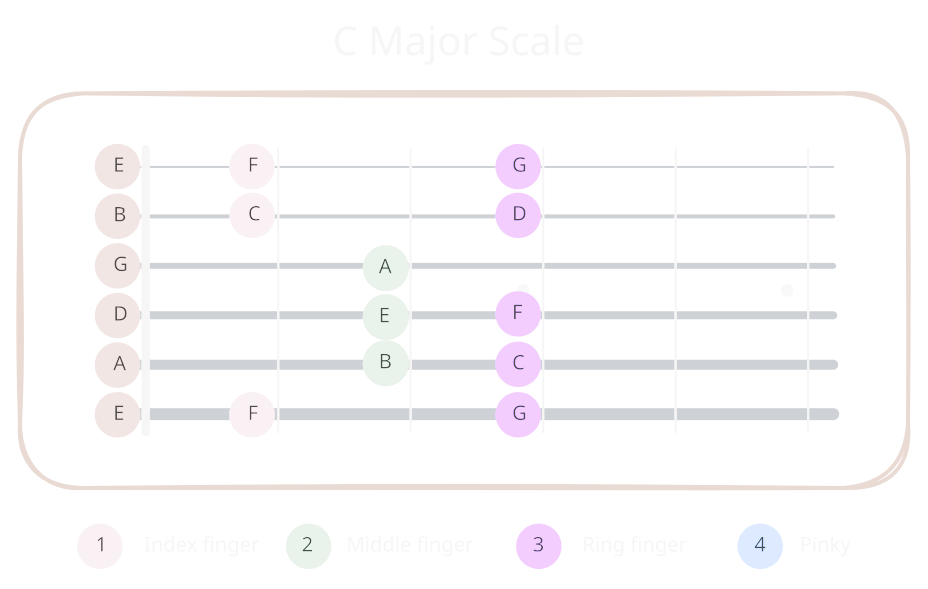
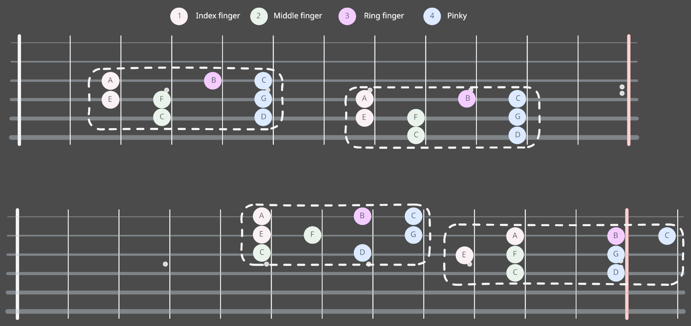
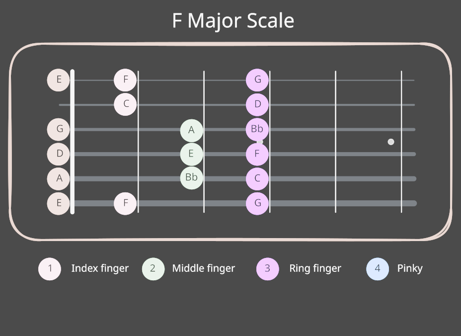
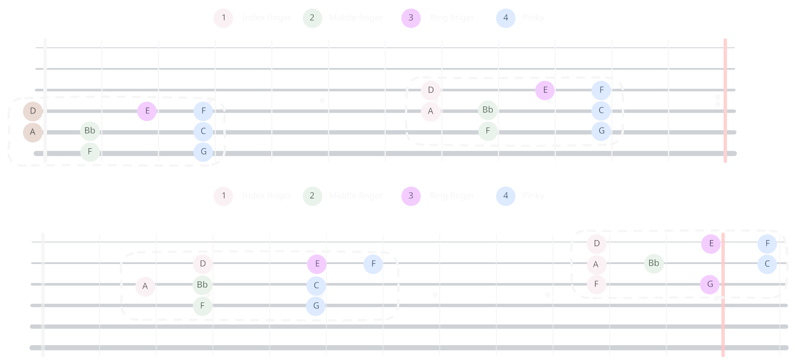

# Exo 1

Placer Do majeur sur la premiere partie du manche 

# Exo 2

Retrouver Do majeur ailleur en prenant en compte la corde qui n'est pas accordée en quarte

# Exo 3

Trouver Fa majeur sur la premiere partie du manche 

# Exo 4

Retrouver Fa majeur ailleur en prenant en compte la corde qui n'est pas accordée en quarte

---

> N'appuie pas trop fort sur les cordes (ne serre pas le manche avec ton pouce)

> Calle tes doigts contre les frets

> Respecter du mieux possible les doigts utilisés

> Faire des aller-retour avec le mediator

> Tu peux tester avec une autre tonalité :P