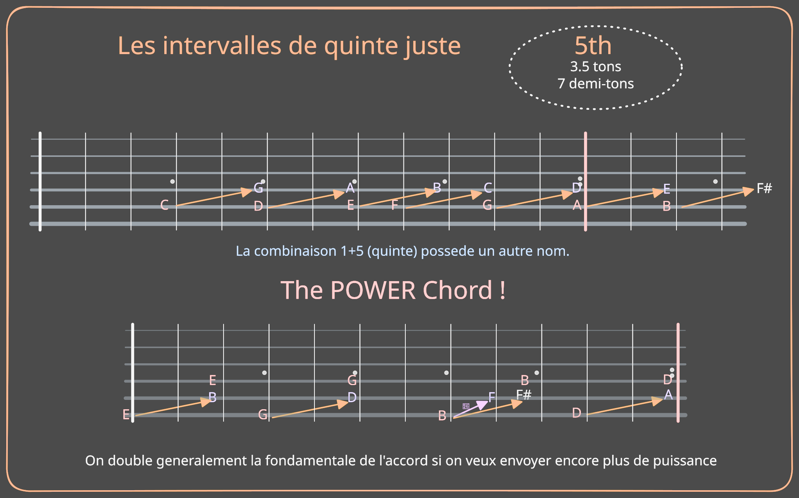
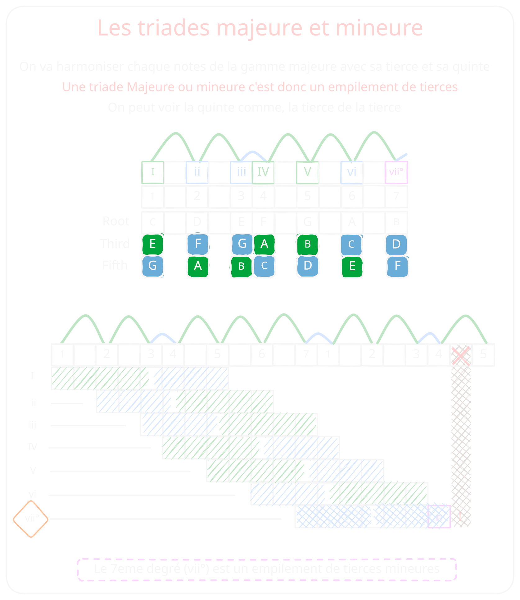
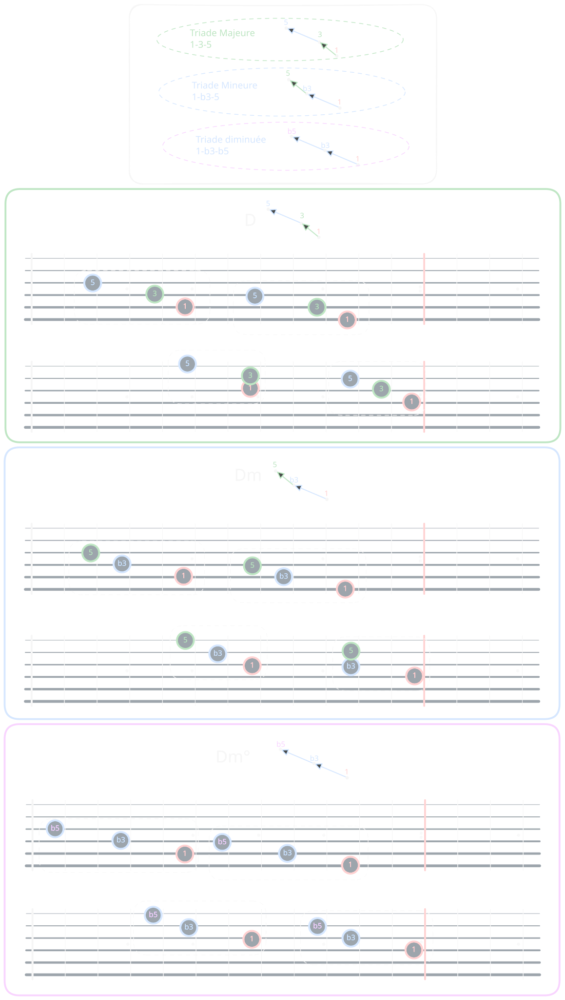
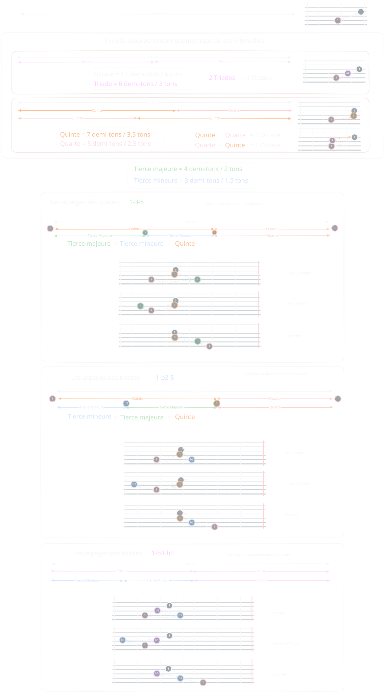

## La tonalité

En musique, la tonalité définit le « point d’ancrage » tonal d’un morceau. Elle comporte deux éléments principaux : la tonique et la gamme.

Par exemple, dans la tonalité de do majeur, la tonique est le do et la gamme est majeure.

La tonique est la note centrale à laquelle la musique semble ancrée : c’est la note vers laquelle les mélodies et les harmonies reviennent souvent pour créer un sentiment de résolution. La gamme est l’ensemble des notes (avec des intervalles spécifiques) construites à partir de cette tonique. Les gammes les plus couramment utilisées en musique populaire sont les gammes majeures et mineures, bien que d’autres modes soient également possibles.

Ensemble, la tonique et la gamme définissent les sept notes qui constituent les éléments de base des accords et des mélodies d’une chanson.
Par exemple, une chanson en do majeur repose sur les notes :

`C` `D` `EF` `G` `A` `BC`

## Les degrés

À chaque note d’une gamme est attribué un degré de gamme, numéroté de 1 à 7 en chiffre romain. Ces degrés de gamme restent les mêmes quelle que soit la tonalité, ce qui nous permet de décrire des idées musicales à l’aide de la notation relative — un concept fondamental. Par exemple, le degré 1 de la gamme est toujours la note "de référence" de la tonalité, même si sa hauteur réelle varie d’une tonalité à l’autre.

À partir de ces notes, on les groupe pour créer les accords couramment utilisés dans cette tonalité :

> On les note en chiffres romain, majuscule pour majeur, miniscule pour mineur.
> Ce sont les degrés d'une gamme.

Do majeur (I), Ré mineur (ii), Mi mineur (iii), Fa majeur (IV), Sol majeur (V), La mineur (vi) et Si diminué (vii°). Ces noms en chiffres romains décrivent la position et la fonction de chaque accord au sein de la tonalité.
> **En général, on prend des exemples en Do pour ne pas avoir trop de notes altéres.**

## Les accords

### L'accord de puissance / Power chord
Voici l'accord avec le plus de puissance, peut etre meme trop pour sa simplicité.

### Triades

Les triades sont les accords les plus communs dans la musique, il faut se familiariser avec eux le mieux possible.

- Major       : 1 3 5
- Minor       : 1 b3 5
    - Diminished  : 1 b3 b5

Voici ce que ca donne sur 3 cordes.

#### Former des arpèges

# Les fonctions des degrés de la gamme majeure.
> TODO

