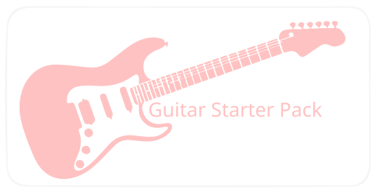
# Les fondamentaux :

> C'est pas des regles.
> Ici, on met juste des etiquettes sur des concepts pour les découvrir, les memoriser, pour communiquer avec d'autres instrumentistes.

## Intervalle

Un intervalle est la différence de hauteur entre deux notes — en d’autres termes, la distance qui les sépare. Ce sont les intervalles qui donnent leur forme aux mélodies et leur sonorité aux accords.
On décrit les intervalles de deux façons : par leur ampleur (le nombre de notes qui les séparent) et par leur qualité (qui leur confère leur sonorité spécifique, comme majeur, mineur, diminué ou augmenté).

Par exemple, l’intervalle entre le do et le mi s’appelle une tierce majeure. On l’appelle « tierce » car il couvre trois degrés de la gamme (do, ré, mi — degrés 1 à 3), et « majeure » parce que les notes sont séparées de quatre demi-tons, ce qui lui confère une sonorité claire et consonante.

Les intervalles se mesurent en demi-tons : la plus petite distance entre deux notes sur un piano. Un demi-ton correspond à la distance entre une touche et la suivante (noire ou blanche). Deux demi-tons forment un ton.

[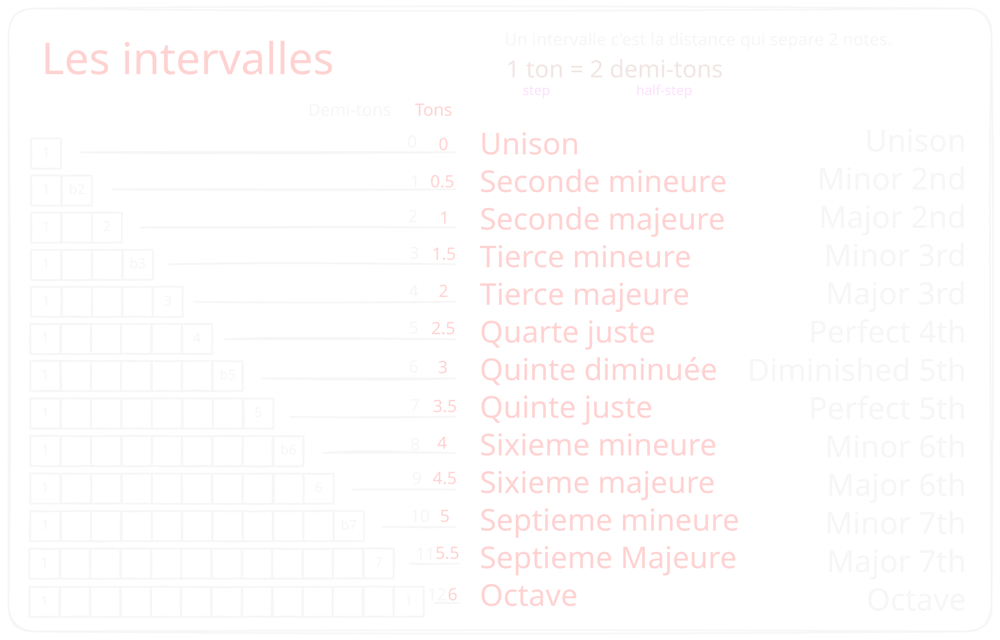](https://raw.githubusercontent.com/Sydekends/excalidraw/refs/heads/main/0.0.interval.excalidraw.svg)

[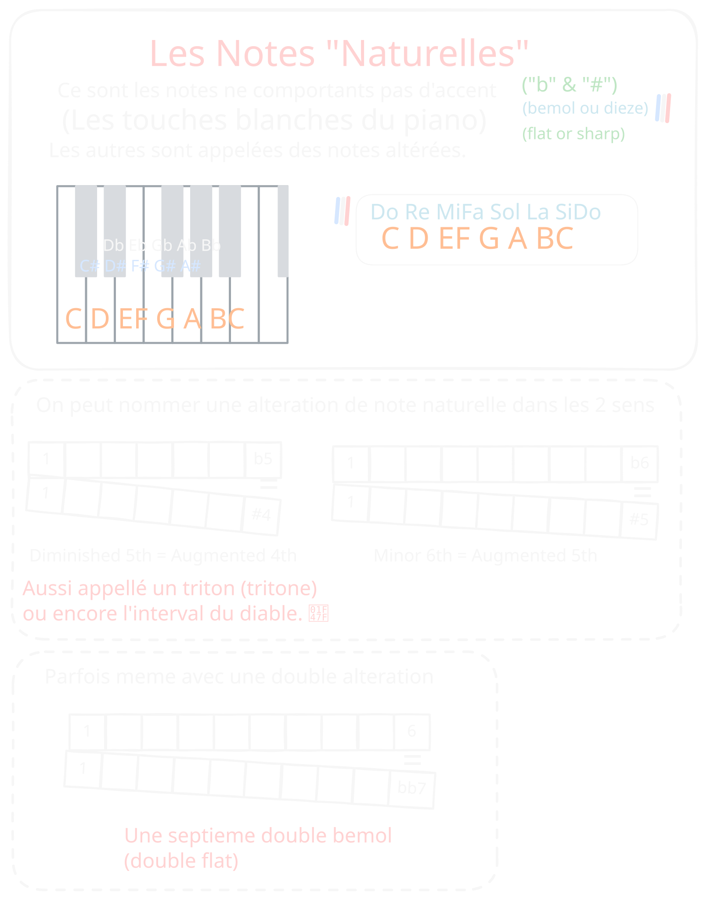](https://raw.githubusercontent.com/Sydekends/excalidraw/refs/heads/main/0.1.notes.excalidraw.svg)

> Une guitare, c'est comme si plusieurs pianos etait empilés, mais les cordes ne mettent pas en evidence les touches noires.

Voici comment poser les notes sur la guitare

[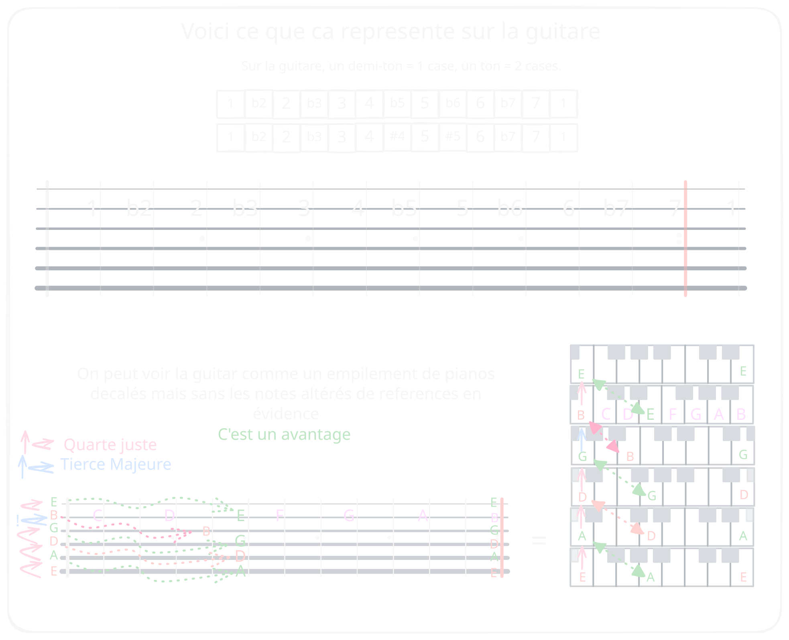](https://raw.githubusercontent.com/Sydekends/excalidraw/refs/heads/main/0.2.piano_on_guitar.excalidraw.svg)

## Gammes

Les gammes sont des ensembles de notes qui constituent la base des mélodies et des accords en musique. La plus connue est la gamme majeure : une série de sept notes qui suivent un schéma spécifique d’intervalles (écarts entre les notes). Ce schéma confère à la gamme majeure sa sonorité claire et familière, et est utilisé dans d’innombrables chansons populaires.

> *La gamme majeure* sert de references à toutes les observations que l'on peut faire sur la musique. 
> C'est elle qu'on a defini sans alteration. 1 2 34 5 6 71

Vous trouverez ci-dessous la gamme de do majeur, sur laquelle est indiqué le nombre de demi-tons entre chaque note. Ces intervalles définissent la structure de la gamme. Au piano, on obtient cette gamme en jouant uniquement les touches blanches : la plupart des notes sont séparées par deux demi-tons (un ton entier) et quelques-unes ne sont séparées que par un demi-ton.

[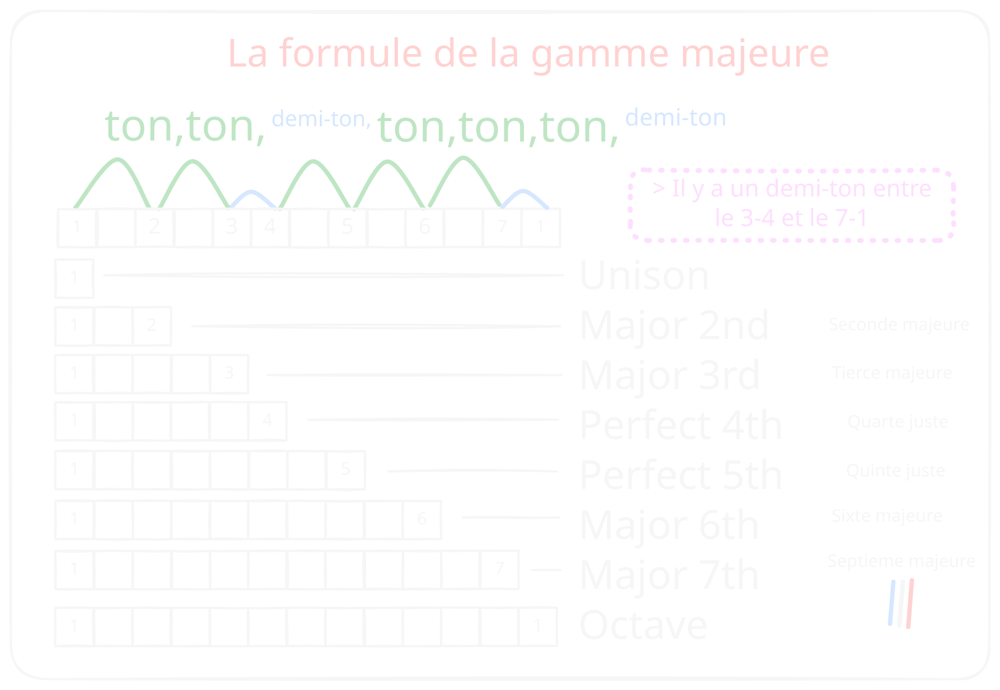](https://raw.githubusercontent.com/Sydekends/excalidraw/refs/heads/main/1.0.scales.excalidraw.svg)
[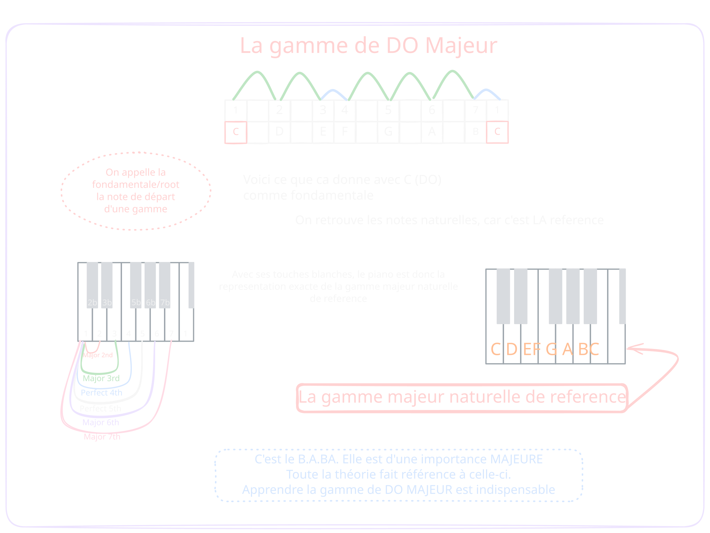](https://raw.githubusercontent.com/Sydekends/excalidraw/refs/heads/main/1.1.scales.excalidraw.svg)
[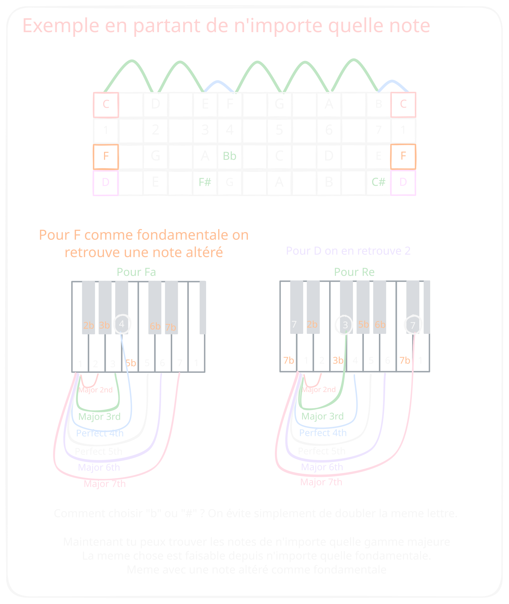](https://raw.githubusercontent.com/Sydekends/excalidraw/refs/heads/main/1.2.scales.excalidraw.svg)
[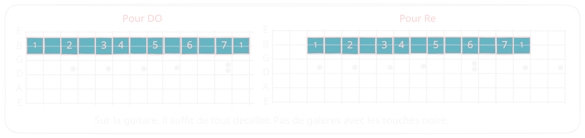](https://raw.githubusercontent.com/Sydekends/excalidraw/refs/heads/main/1.3.scales.excalidraw.svg)

On peut aussi voir plus bas les gammes de Fa et de Re majeur. Elles utilisent le même schéma d’intervalles que la gamme de do majeur, mais commencent sur une note différente.
Pour conserver le même son (c’est-à-dire le même espacement entre les notes), elles comprennent des notes altérées : (Xb)(X#)

# Harmonie

## La tonalité

En musique, la tonalité définit le « point d’ancrage » tonal d’un morceau. Elle comporte deux éléments principaux : la tonique et la gamme.

Par exemple, dans la tonalité de do majeur, la tonique est le do et la gamme est majeure.

La tonique est la note centrale à laquelle la musique semble ancrée : c’est la note vers laquelle les mélodies et les harmonies reviennent souvent pour créer un sentiment de résolution. La gamme est l’ensemble des notes (avec des intervalles spécifiques) construites à partir de cette tonique. Les gammes les plus couramment utilisées en musique populaire sont les gammes majeures et mineures, bien que d’autres modes soient également possibles.

Ensemble, la tonique et la gamme définissent les sept notes qui constituent les éléments de base des accords et des mélodies d’une chanson.
Par exemple, une chanson en do majeur repose sur les notes 
`C` `D` `E` `F` `G` `A` `B`

À partir de ces notes, on obtient l’ensemble des accords couramment utilisés dans cette tonalité :
> On les note en chiffres romain, majuscule pour majeur, miniscule pour mineur.
> Ce sont les degrees d'une gamme.
 Do majeur (I), Ré mineur (ii), Mi mineur (iii), Fa majeur (IV), Sol majeur (V), La mineur (vi) et Si diminué (vii˚). Ces noms en chiffres romains décrivent la position et la fonction de chaque accord au sein de la tonalité.
> **En général, on prend des exemples en Do pour ne pas avoir trop de notes altéres.**

## Les intervalles en details

### Unison

[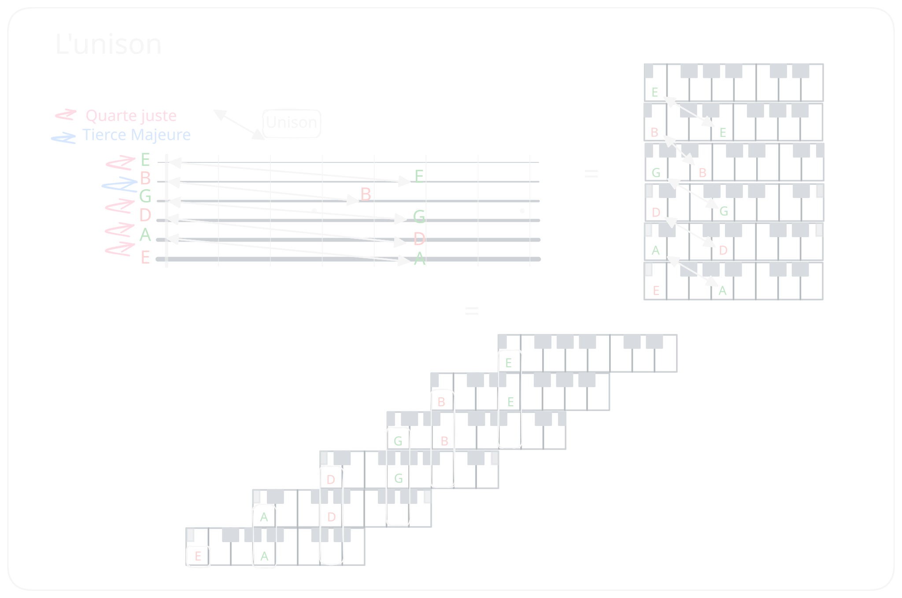](https://raw.githubusercontent.com/Sydekends/excalidraw/refs/heads/main/2.0.0th.excalidraw.svg)

### L'octave
Un octave c'est 6 tons  / 12 demi-tons

[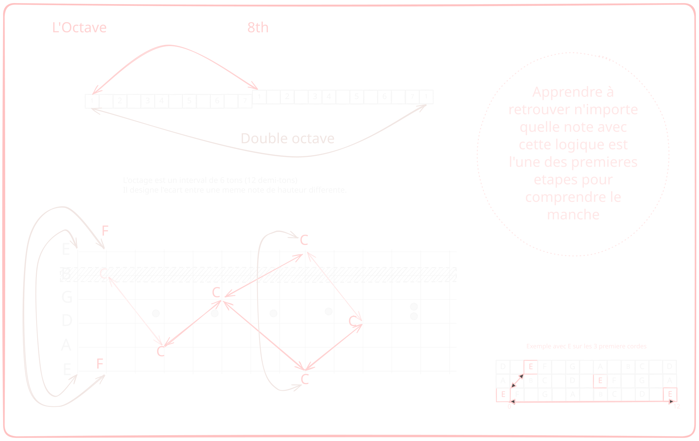](https://raw.githubusercontent.com/Sydekends/excalidraw/refs/heads/main/2.0.8th.excalidraw.svg)

### Le triton
`La quarte augmentée` | `La quinte diminuée`
Comme son nom l'indique Le triton est un intervalle de 3 tons (6 demi-tons) 
il possede une sonoritée dissonante

> ⚠️ Info incroyable pour se repérer sur le manche.
>       C'est exactement la moitié d'un octave.
>       Il est entouré de la quarte juste, et de la quinte juste
>       Le triton du triton est la note de départ.

[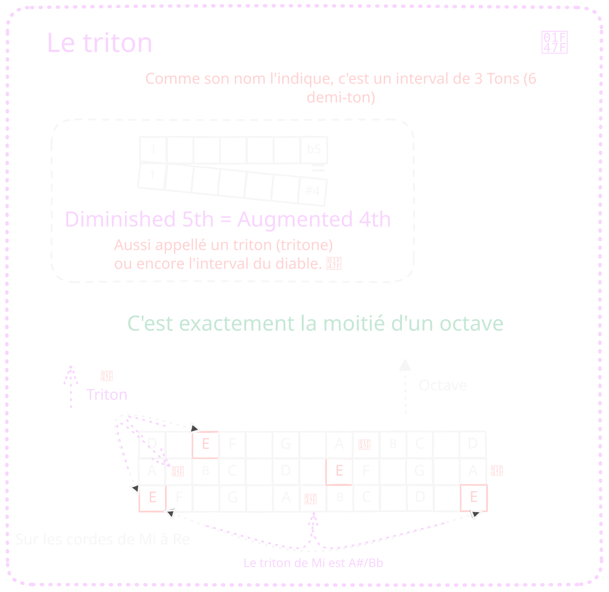](https://raw.githubusercontent.com/Sydekends/excalidraw/refs/heads/main/2.1.5thb.tritone.excalidraw.svg)
Dans la gamme majeure, le triton est present  
**4#** du 4eme degree "**IV**"
**5b** du 7eme degree "**vii**"

### La quarte juste | Perfect Fourth

La guitare est un instrument accordé en quarte.
> Sauf pour la corde de SI(B)

[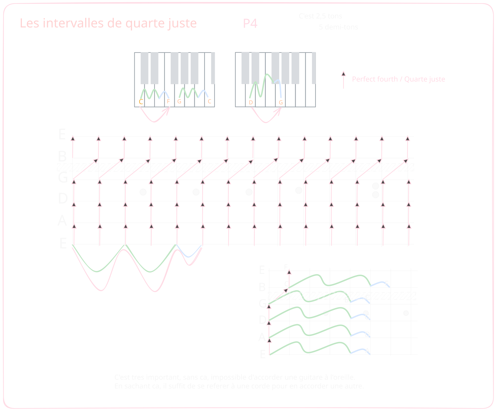](https://raw.githubusercontent.com/Sydekends/excalidraw/refs/heads/main/2.0.4th.excalidraw.svg)

#### Dans la gamme majeure

[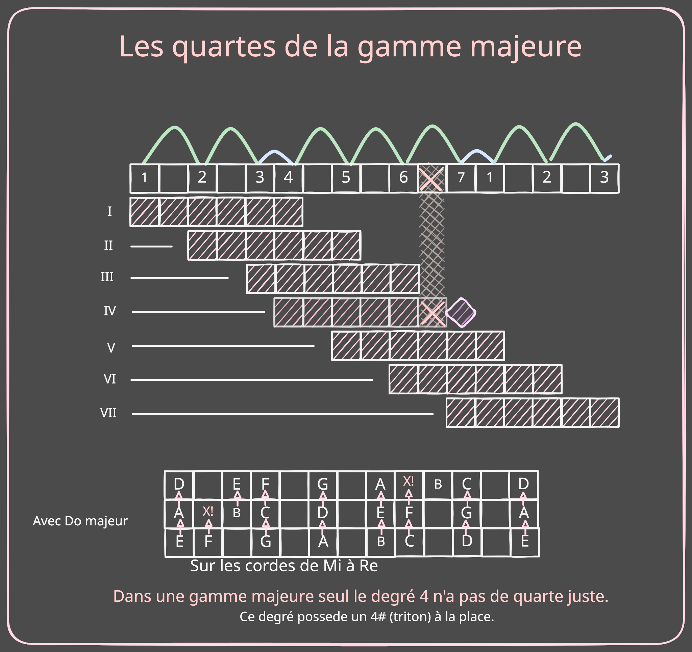](https://raw.githubusercontent.com/Sydekends/excalidraw/refs/heads/main/2.0.4th.majorscale.excalidraw.svg)

> Dans la gamme majeure naturelle, le 4eme degree (IV) possede une quarte augmentée.

### La quinte juste | Perfect Fifth

[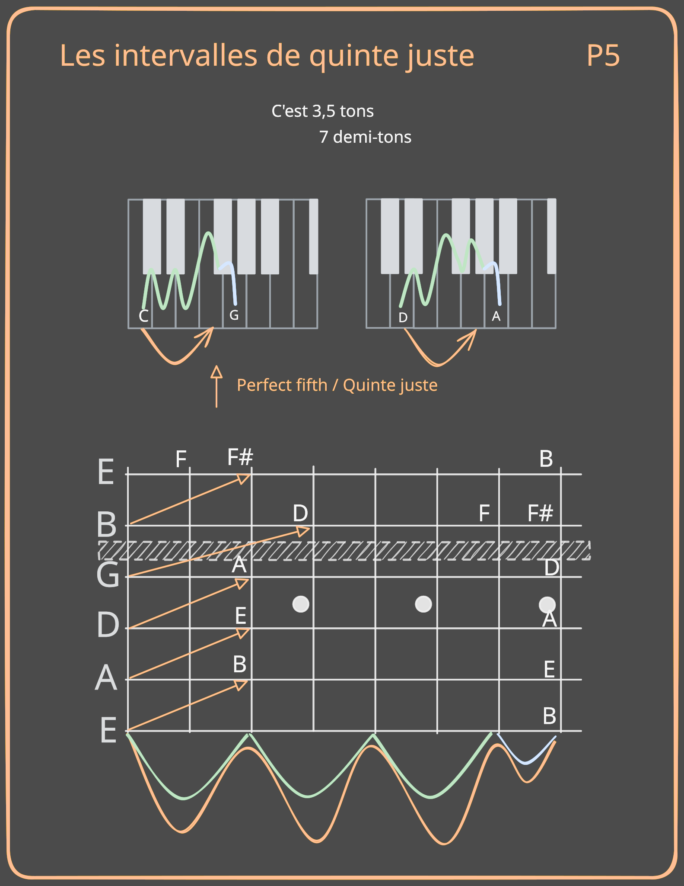](https://raw.githubusercontent.com/Sydekends/excalidraw/refs/heads/main/2.1.5th.excalidraw.svg)

#### Dans la gamme majeure
[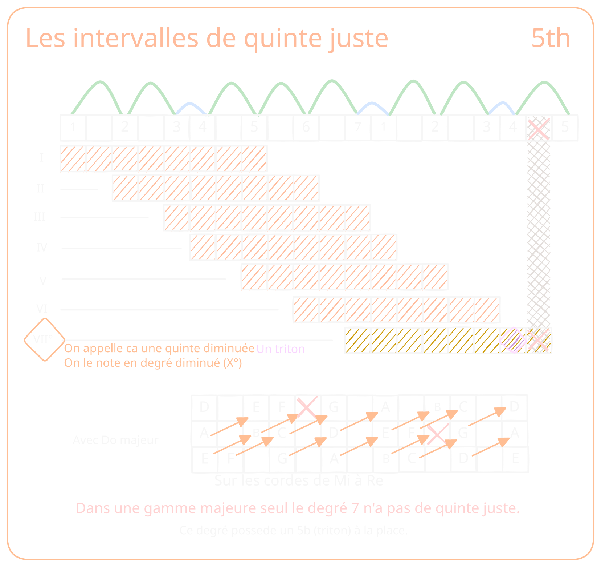](https://raw.githubusercontent.com/Sydekends/excalidraw/refs/heads/main/2.1.5th.majorscale.excalidraw.svg)

> Dans la gamme majeure naturelle, le 7eme degree (vii) possede une quinte diminuée.
> On note donc ce degré vii° => pour "diminué"

### Les tierces | Third

On appelle "tierce" 2 intervalles differents.
On trouve la tierce majeure : 3 | C'est un intervalle de 2 ton. (4 demi-tons)
et la     la tierce majeure : 3 | C'est un intervelle de 1.5 tons. (3 demi-tons)

[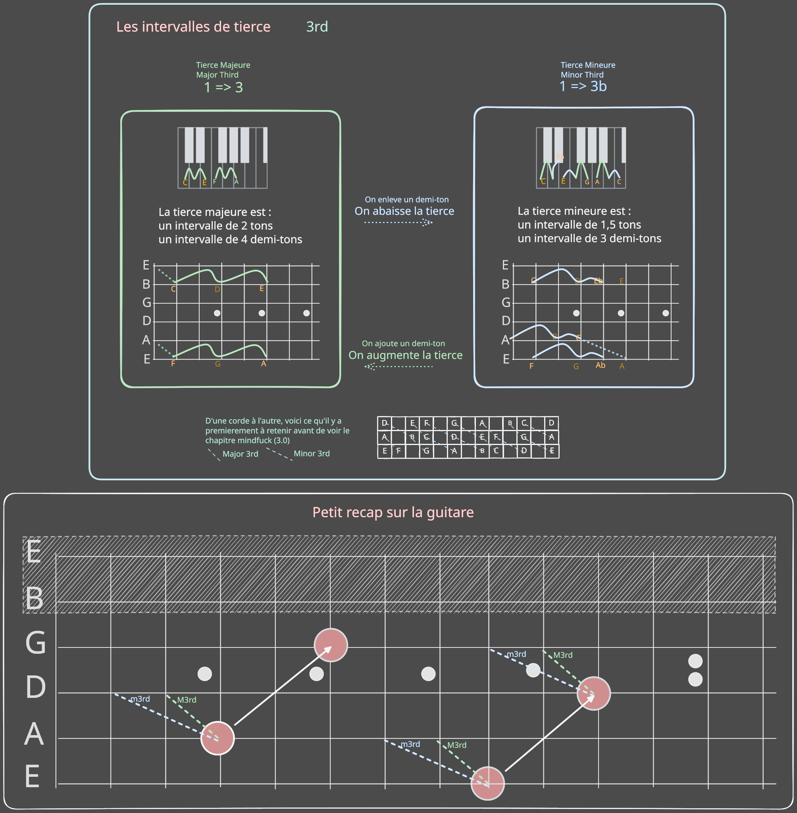](https://raw.githubusercontent.com/Sydekends/excalidraw/refs/heads/main/2.1.3rd.excalidraw.svg)

[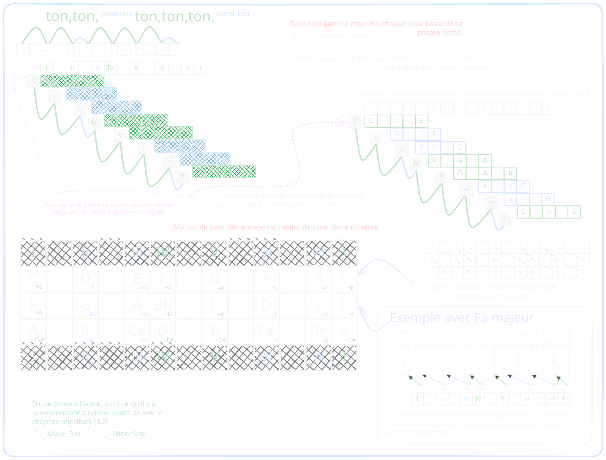](https://raw.githubusercontent.com/Sydekends/excalidraw/refs/heads/main/2.1.3rd.majorscale.excalidraw.svg)

> Dans la gamme majeure naturelle :
>   - Les degrees I, IV et V sont majeurs
>   - Les degrees ii, iii, vi et vii sont mineurs

## Tuning
Comment accorder sa guitare 
[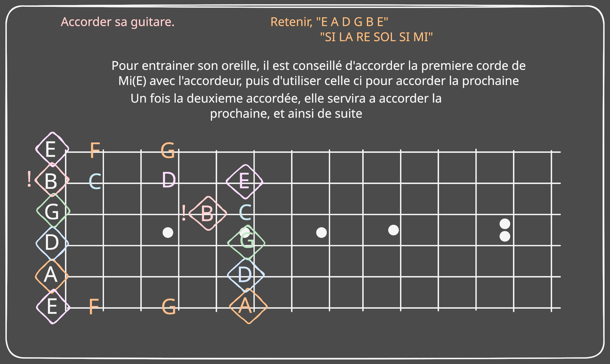](https://raw.githubusercontent.com/Sydekends/excalidraw/refs/heads/main/2.0.0.tuning.excalidraw.svg)

## Comprendre le manche

[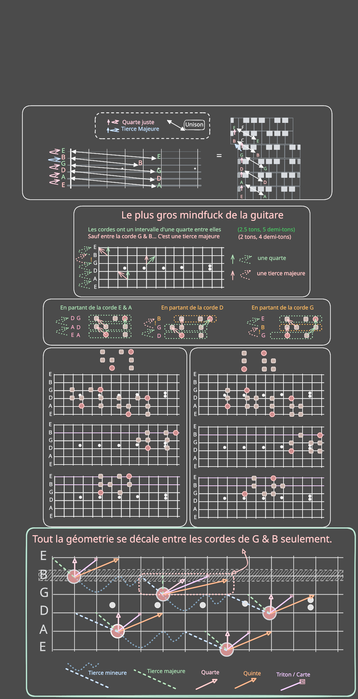](https://raw.githubusercontent.com/Sydekends/excalidraw/refs/heads/main/X.mindfuck.excalidraw.svg)

## Les accords

### L'accord de puissance / Power chord
Voici l'accord avec le plus de puissance, peut etre meme trop pour sa simplicité.

> PowerChord = **(1 5 1)**
> Pourquoi meme s'embeter avec le 7eme degree ? C'est si puissant qu'on peut faire entendre une quinte, pas de probleme. 

## Triades

Major       : 1 3 5
Minor       : 1 b3 5
Diminished  : 1 b3 b5

[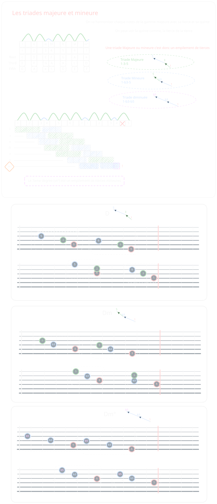](https://raw.githubusercontent.com/Sydekends/excalidraw/refs/heads/main/3.1.triad.excalidraw.svg)
<!-- 

## Notation relative.

À chaque note d’une gamme est attribué un degré de gamme, numéroté de 1 à 7. Ces degrés de gamme restent les mêmes quelle que soit la tonalité, ce qui nous permet de décrire des idées musicales à l’aide de la notation relative — un concept fondamental. Par exemple, le degré 1 de la gamme est toujours la note "de référence" de la tonalité, même si sa hauteur réelle varie d’une tonalité à l’autre.
<!-- rouge pour le 1, orange pour le 2, jaune pour le 3, et ainsi de suite — afin que vous puissiez reconnaître instantanément leur rôle et leur fonction. 

## Gamme relative

[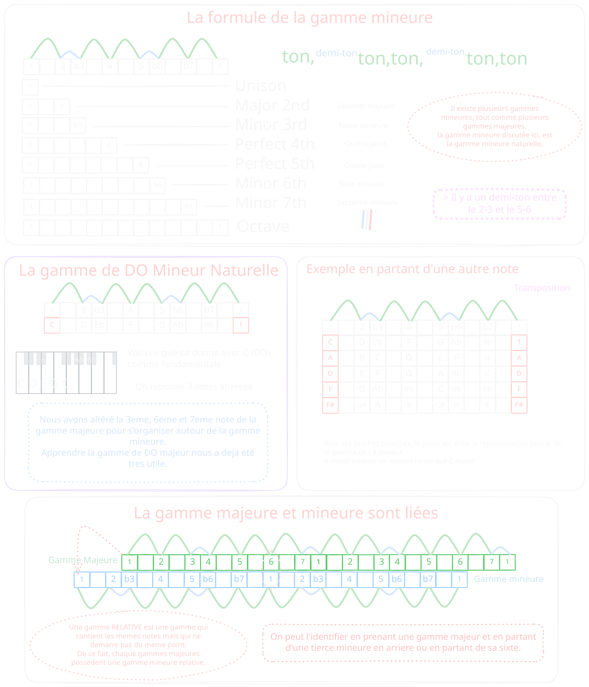](https://raw.githubusercontent.com/Sydekends/excalidraw/refs/heads/main/X.minorscale.excalidraw.svg)

[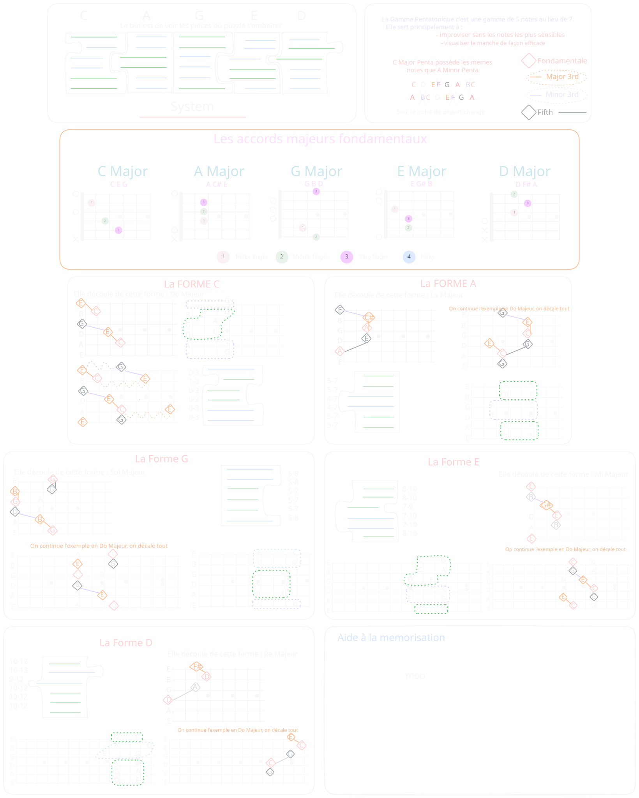](https://raw.githubusercontent.com/Sydekends/excalidraw/refs/heads/main/X.CAGED.excalidraw.svg) -->